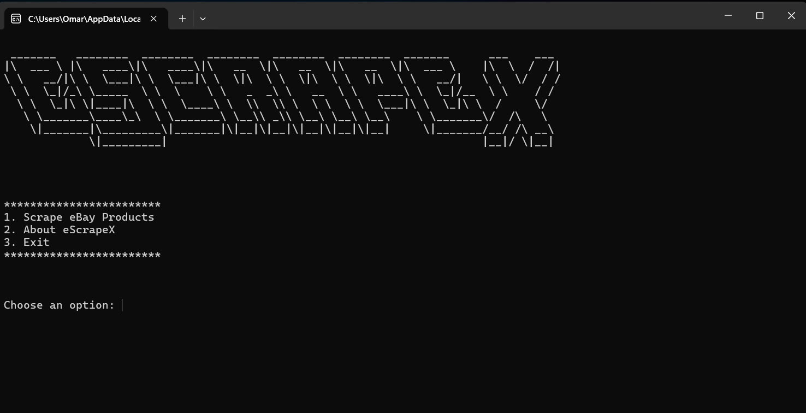
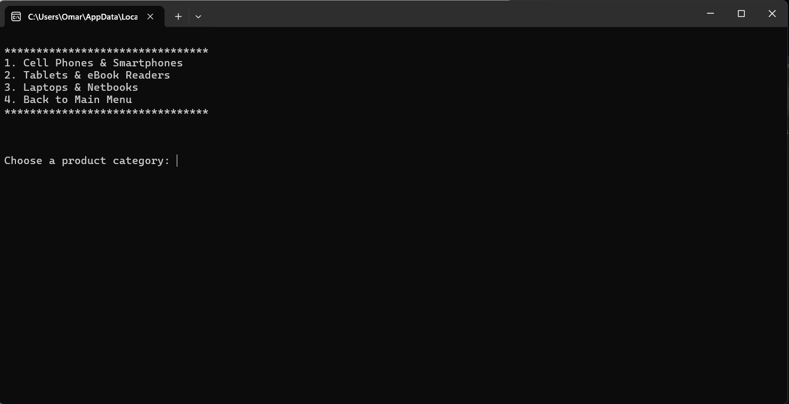
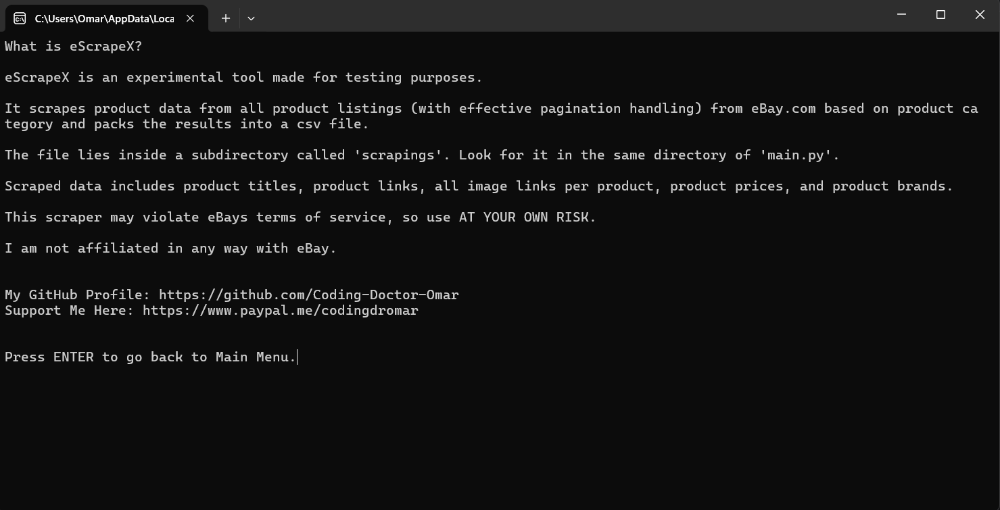
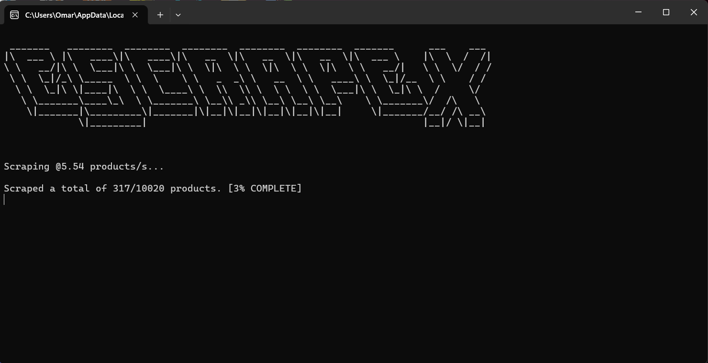
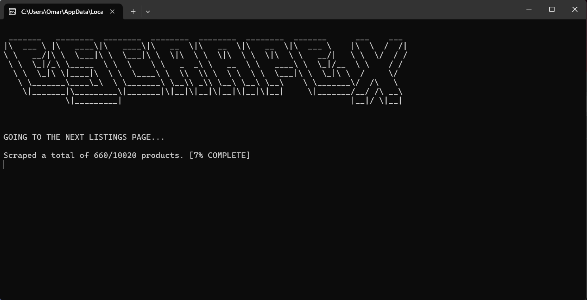
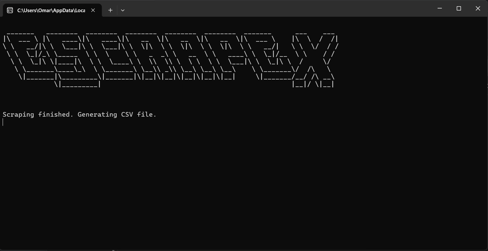
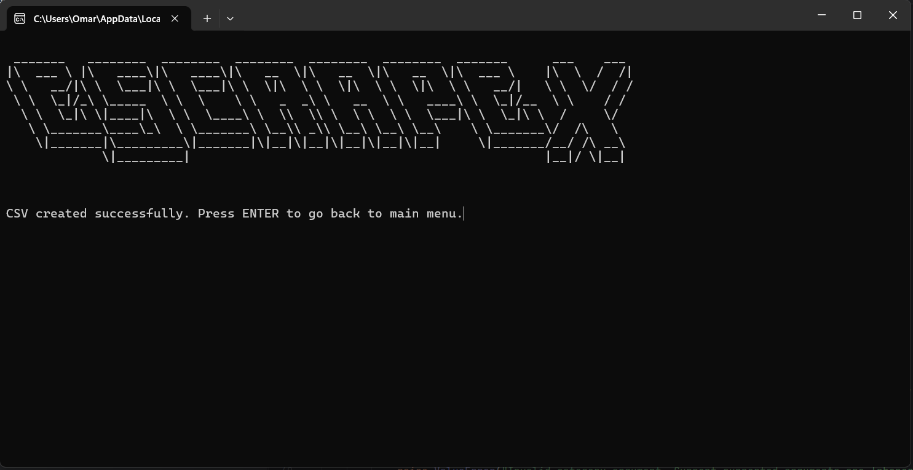
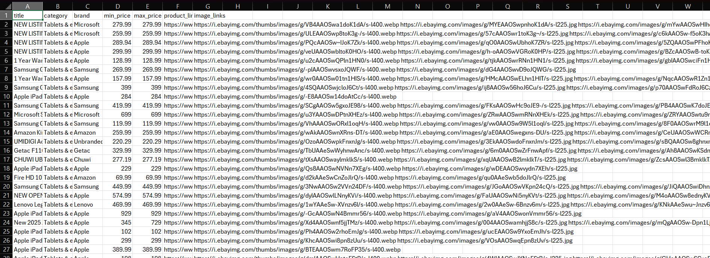

# Setup Instructions
1. Make sure you have the latest version of Python installed on your computer.
2. Run 'setup.py' directly, not inside an IDE. If you run it inside an IDE like PyCharm, the scraper will only work inside the IDE, but the scraper will still not be usable directly from your computer.
3. Now you are ready to go! Run 'main.py' to launch the app.

# Features
## License
🛡️ License: Proprietary (All rights reserved)

This project is licensed under a proprietary license.  
You may not copy, modify, or redistribute this code without my explicit written permission.  
For inquiries, please contact me at codingdromar@outlook.com

### This scraper is a demo. It currently contains only 3 categories; however, the code is organized and easily scalable to include the entire eBay website.

1. This scraper works on the international eBay website (ebay.com).
2. The scraper has a clear and simple text-based user-interface.
3. You can choose the product category you want to scrape.
4. The scraper will scrape all public product listings of your chosen category (with effective pagination handling) and will extract the following details per product:
   1. Product title
   2. Product category
   3. Product brand
   4. Product minimum and maximum prices if there is a price range; otherwise, the minimum price will be equal to the maximum price.
   5. Product eBay link
   6. All direct image urls of this eBay product listing
5. The scraper will then clean full product duplicates, not subset duplicates.
6. Finally, the dataset will be placed in a csv file inside the 'scrapings' subdirectory.
7. You can then use Pandas or whichever data analysis tool you prefer to do your analysis!
8. Throughout the scraping process, live progress and estimated live scraping speed in products/s is displayed.

_Note: Make sure you have a good internet connection when using this scraper._

# WARNINGS AND DISCLAIMERS
1. This scraper may violate eBay's terms of service, so use AT YOUR OWN RISK.
2. I am NOT affiliated with eBay in any way whatsoever.
3. I am NOT RESPONSIBLE for any misuse on your part.

# Screenshots
Main Menu

Categories Menu

About Screen

Scraping Screen

Scraping Finished Screen

CSV Finished Screen

CSV Structure

# Final Thoughts
Feel free to suggest any improvements!

Support me [here](https://www.paypal.me/codingdromar). Thank you :)